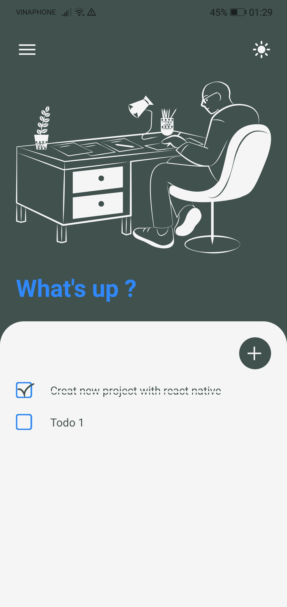
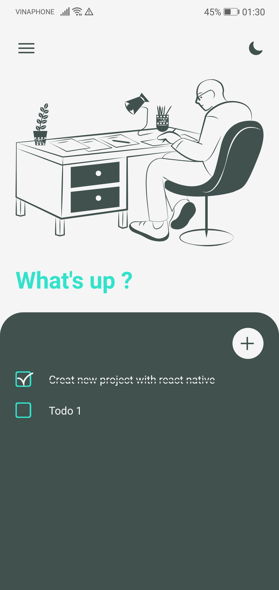
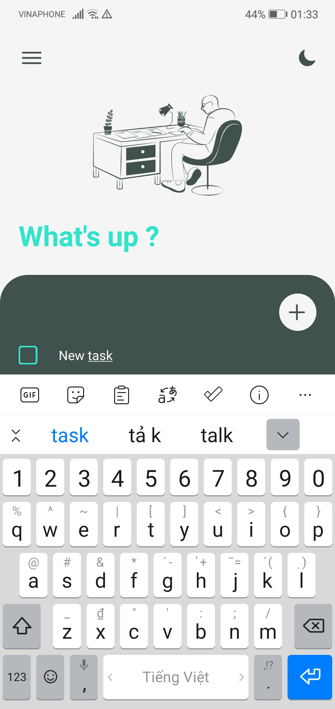
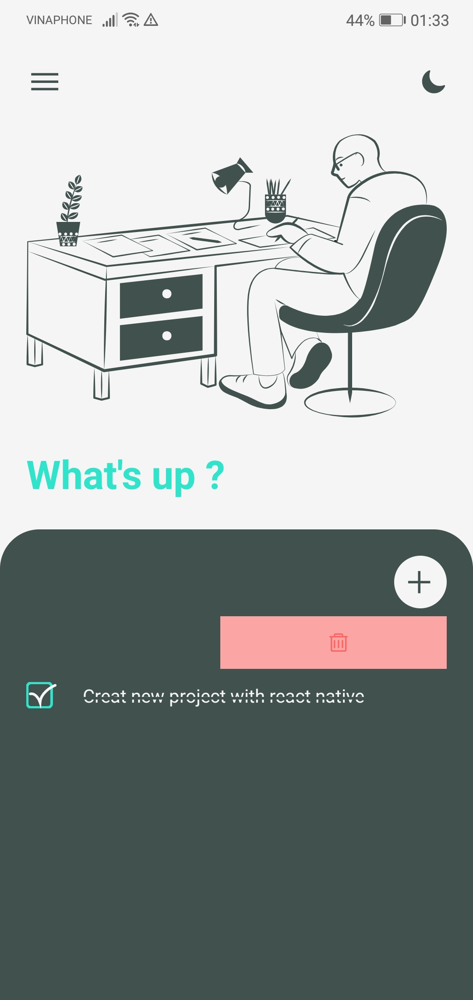
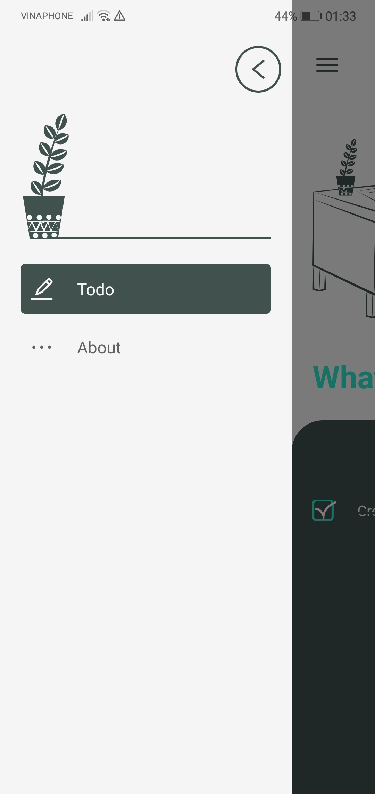
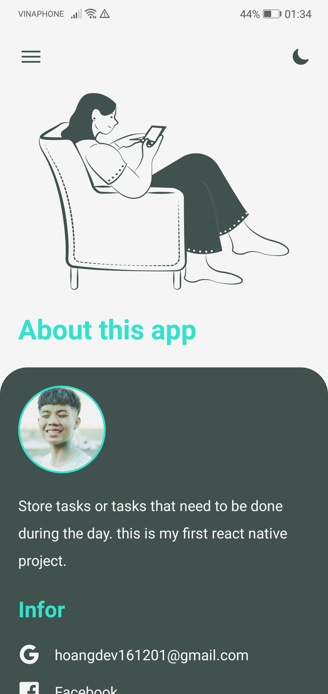

# Todo list app:

### Description:

*  Store tasks or tasks that need to be done during the day. this is my first react native project.

### file apk to demo:

* [todolist-2b1769ec662043ab9d8bce179bb4968b-signed](https://github.com/HoangNguyen161201/todo-list/blob/main/todolist-2b1769ec662043ab9d8bce179bb4968b-signed.apk)

### Packages that I use in the project:

* @expo/vector-icons
* @react-native-async-storage/async-storage
* @react-navigation/drawer
* @react-navigation/native
* react-native-anchor-point
* react-native-gesture-handler
* react-native-reanimated
* react-native-safe-area-context
* react-native-svg
* react-native-uuid

### Images:

* Icon:

  

* This app supports dark mode:

  

  

* Create task:

  

* Delete Task:

  

* Sidebar:

  

* About this app:

  

